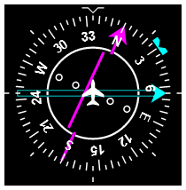

Horizontal Situation Indicator
==============================

A Vanilla JavaScript [web component](https://www.webcomponents.org/) which displays a self-contained [Horizontal Situation Indicator](https://en.wikipedia.org/wiki/Horizontal_situation_indicator), an airplane cockpit instrument used for instrument navigation.



For a demo see https://3960.org/webcomponent-hsi/.

Installation
------------

Either download the [`horizontal-situation-indicator.js`](horizontal-situation-indicator.js) to a sensible location in your web project, or do a NPM installation:

```bash
npm install @fboes/horizontal-situation-indicator --save
```

Instead of a local installation you may also load the library from https://unpkg.com/. Beware: This makes https://unpkg.com/ a dependency of your project and may pose data protection issues.

```html
<script type="module" src="https://unpkg.com/@fboes/horizontal-situation-indicator@latest/horizontal-situation-indicator.js"></script>
```

Everything required for the frontend functionality of this web component is contained in [`horizontal-situation-indicator.js`](horizontal-situation-indicator.js).

---

Usage
-----

Loading the library prior to use:

```html
<!-- load element library -->
<script type="module" src="horizontal-situation-indicator.js"></script>
```

Invoke a new instance by placing this into your HTML source code:

<!--
```
<custom-element-demo>
  <template>
    <script type="module" src="https://unpkg.com/@fboes/horizontal-situation-indicator@latest/horizontal-situation-indicator.js"></script>
    <next-code-block></next-code-block>
  </template>
</custom-element-demo>
```
-->
```html
<!-- use element -->
<horizontal-situation-indicator heading="45.0" heading-select="0.0"></horizontal-situation-indicator>
```

### Simple compass

```html
<horizontal-situation-indicator heading="45.0" heading-select="0.0"></horizontal-situation-indicator>
```

### HSI with NAV1 tuned to ADF

```html

<horizontal-situation-indicator heading="45.0" heading-select="0.0"
  nav1-bearing="10.0"></horizontal-situation-indicator>
```

### HSI with NAV2 tuned to VOR

```html
<horizontal-situation-indicator heading="45.0" heading-select="0.0"
  nav2-course="0.0" nav2-deviation="0.0" nav2-to="-1"></horizontal-situation-indicator>
```

Properties
----------

Properties can be set on initialization via HTML attributes, or selecting the DOM node via JavaScript and setting the properties of the DOM node.

If a property is not set or unset, the corresponding HSI component will be hidden.

| Name                   | Type         | Default | Description                |
| ----------------       | ------------ | ------- | -------------------------- |
| `heading`              | ?`degree`    | `null`  |                            |
| `heading-select`       | ?`degree`    | `null`  |                            |
| `nav1-label`           | ?`string`    | `null`  |                            |
| `nav1-course`          | ?`degree`    | `null`  |                            |
| `nav1-deviation`       | ?`deviation` | `null`  | Only visible when `nav1-course` is set. |
| `nav1-bearing`         | ?`degree`    | `null`  | This will also set `nav1-to` and `nav1-deviation` accordingly. |
| `nav1-to`              | ?`switch`    | `null`  | If set to `1` will show the TO-flag, if set to `-1` will show the FROM-flag. |
| `nav2-label`           | ?`string`    | `null`  |                            |
| `nav2-course`          | ?`degree`    | `null`  |                            |
| `nav2-deviation`       | ?`deviation` | `null`  | Only visible when `nav2-course` is set. |
| `nav2-bearing`         | ?`degree`    | `null`  | This will also set `nav2-to` and `nav2-deviation` accordingly. |
| `nav2-to`              | ?`switch`    | `null`  | If set to `1` will show the TO-flag, if set to `-1` will show the FROM-flag. |

Types prefixed with `?` allow setting value to `null` as well.

Special types:

| Type        | Description |
| ----------- | ----------- |
| `degree`    | A float number with 0 ≤ `degree` < 360. `degree` out of this range will be converted to a corresponding value in this range, e.g. `-1.0` will be `359.0`. |
| `deviation` | A float number with -180 ≤ `deviation` < 180. `deviation` out of this range will be converted to a corresponding value in this range. `deviation` > 0 showing the the chosen course to be right / above, `deviation` < 0  showing the the chosen course to be left / below. A value of `±5.0` (`±175`) will move the marker to the first dot, a value of `±10.0` (`±170`) will move the marker to the second dot. |

Methods
-------

There are no public methods.

Events
------

There are no events.

Styling
-------

To change the layout of the HSI component use CSS variables. There is a set of defined CSS variables which you may use:

```css
horizontal-situation-indicator {
  --background-outer-color: black;
  --foreground-color: white;
  --foreground-color: white;
  --lubber-color: darkorange;
  --heading-select-color: cyan;
  --nav1-color: magenta;
  --nav2-color: cyan;
  --stroke-width: 0.5;
}
```

Browser compatibility
---------------------

See [compatibility chart](https://caniuse.com/#search=web%20components):

* Google Chrome 67+
* Mozilla Firefox 63+
* Microsoft Edge 79+
* Opera 64+

If you need extended compatibility, search for [Web Components Polyfills](https://www.webcomponents.org/polyfills/).

---

Development
-----------

* Run `npm run build` to copy files from `src` directory into main JavaScript file.
* Run `npm run serve` to launch a development web server.
* The property `debug="1"` will activate additional output to `console`.

Status
-------

[](https://travis-ci.org/fboes/webcomponent-hsi)
[](https://badge.fury.io/gh/fboes%2Fwebcomponent-hsi)
[](https://badge.fury.io/js/%40fboes%2Fhorizontal-situation-indicator)
[](https://www.webcomponents.org/element/@fboes/horizontal-situation-indicator)


Legal stuff
-----------

Author: [Frank Boës](https://3960.org)

Copyright & license: See [LICENSE.txt](LICENSE.txt)
